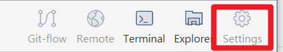
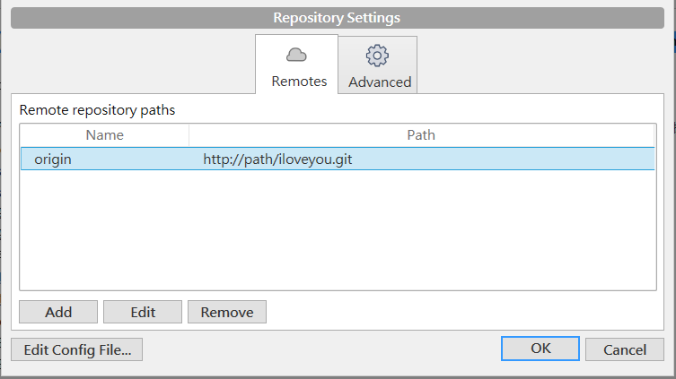
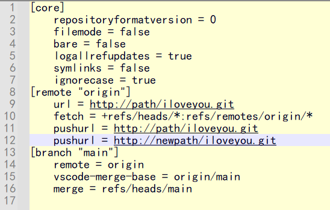

# SGS.OAD.Resource


## 目錄

[Git](#git)  
[Personal Static Web](#personal-static-web)  
[Json](#json)  
[Markdown](#markdown)  
[favicon.ico](#faviconico)  
[SVG](#svg)

## Git

### 自動 clone mapping repo 到某個 remote repo (同步)
- 將現有的資料從 **Git-A 伺服** clone 同步到 **Git-B 伺服** 的同名 repo (SGS.REL.IP68)，可以按照以下步驟操作
  - A 伺服（原本的）
    - 路徑：`http://path/iloveyou.git`
  - B 伺服（新的） - 空的 repo，無 README.md 也無 LICENSE 等文檔
    - 路徑：`http://newpath/iloveyou.git`

執行以下命令，確認遠端路徑是否正確：
```Git
git remote -v
```
輸出應類似於：
```Git
origin  http://path/iloveyou.git (fetch)
origin  http://path/iloveyou.git (push)
```
設定多個 `remote.push`（自動推送）  
方式一，使用 bash：
```Git
git remote set-url --add --push origin http://newpath/iloveyou.git
```
方式二，在 Source Tree 裡操作，直接修改 Git-A config：  
1. 點擊 `Settings`  
    
    
2. 點擊 `Edit Config FIle...` 加入新的 pushurl `http://newpath/iloveyou.git`  
    

再次確認遠端路徑：
```Git
git remote -v
```
輸出應類似於：
```Git
origin  http://path/iloveyou.git (fetch)
origin  http://path/iloveyou.git (push)
origin  http://newpath/iloveyou.git (push)
```
推送分支方式一，使用 bash：
- `--all`：推送所有分支到遠端
- `--tags`：推送所有標籤到遠端
```Git
git push origin -all -tags
```
推送分支方式二，在 Source Tree 裡操作：
- 直接在 Source Tree 裡對 Git-A 做 push 操作時，會自動同步到 mapping clone 到 Git-B

## Personal Static Web
- [Sankalp Static Web Site](http://twtpeoad002/sankalp/)

## JSON
- [JSON Edior Online](https://jsoneditoronline.org/) **線上編輯 JSON 和美化排版**

## Markdown
- [Markdown](https://markdown.tw/)
- [Mermaid](https://mermaid.js.org/) - **Markdown 裡放圖表**
- [Shields.io](https://shields.io/) - **Markdown 檔 Badge 徽章效果 API**
- [Simple-icons badge slug](https://github.com/simple-icons/simple-icons/blob/master/slugs.md) - **Markdown 檔 Badge 徽章效果清單**

## favicon.ico
- [RealFaviconGenerator](https://realfavicongenerator.net/)
- [Favicon.io](https://favicon.io/)

## SVG
- [svgrepo](https://www.svgrepo.com/vectors/github/)