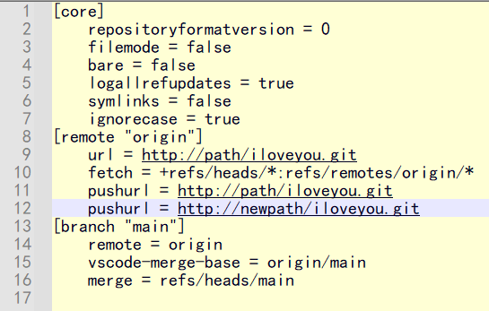

# SGS.OAD.Resource


## 目錄

[Git](#git)  
[Git Push Via Set pushurl 一鍵 push](#git-push-via-set-pushurl-一鍵-push)  
[Personal Static Web](#personal-static-web)  
[Json](#json)  
[Markdown](#markdown)  
[favicon.ico](#faviconico)  
[SVG](#svg)  
[Test](#test)

## 📚Git

### 同步 repo
**`僅適用目標 repo 為全新空的 repo`**

### Git Push Via Set pushurl 一鍵 push  
  `Repo`
  - A 伺服（原本的）
    - 路徑：`http://path/iloveyou.git`
  - B 伺服（新的） - 空的 repo，無 README.md 也無 LICENSE 等文檔
    - 路徑：`http://newpath/iloveyou.git`

  執行以下命令，確認遠端路徑是否正確：
  ```bash
  git remote -v
  ```
  輸出應類似於：
  ```bash
  origin  http://path/iloveyou.git (fetch)
  ```

  設定多個 `remote.push`（自動推送）  
  方式一，使用 bash：  **`留意，要將原來源 repo 也加進去`**
  ```bash
  git remote set-url --add --push origin http://path/iloveyou.git
  git remote set-url --add --push origin http://newpath/iloveyou.git
  ```
  方式二，在 Source Tree 裡操作，直接修改 Git-A config：
  1. 點擊 `Settings`  
      
    
  2. 點擊 `Edit Config FIle...` 加入 pushurl `http://path/iloveyou.git` 和 `http://newpath/iloveyou.git`  
    

  再次確認遠端路徑：
  ```bash
  git remote -v
  ```
  輸出應類似於：
  ```bash
  origin  http://path/iloveyou.git (fetch)
  origin  http://path/iloveyou.git (push)
  origin  http://newpath/iloveyou.git (push)
  ```
  **推送方式一，使用 bash**：
  - `main` 一般 push
  ```bash
  git push origin main
  ```
  - `--all`：推送所有分支到遠端
  - `--tags`：推送所有標籤到遠端
  ```bash
  git push origin -all -tags
  ```
  **推送方式二，在 Source Tree 裡操作**：
  - 直接在 Source Tree 裡對 Git-A 做 push 操作時，會自動同步到 mapping clone 到 Git-B

### Git Push Via add remote 增加遠端 remote
**推送方式一，使用 bash**：
```bash
git remote --add oadip68 http://newpath/iloveyou.git
```
若目標同步的remote本身內容非空，但確定要全部覆蓋過去，則需執行一次 force 強制推送先全部蓋過
```bash
git push -f origin main
```
之後正常推送即可
```bash
git push origin main
```
**推送方式二，在 Source Tree 裡操作**：
  1. 點擊 `Settings`，於 Remotes 頁點擊 Add 按鈕直接新增 Remote repository paths  
    `http://newpath/iloveyou.git`  
      
    
  2. 接著在 Source Tree 中 Push 時，手動選擇 repo

## 🌐Personal Static Web
- [Sankalp Static Web Site](http://twtpeoad002/sankalp/)

## 📦JSON
- [JSON Edior Online](https://jsoneditoronline.org/) **線上編輯 JSON 和美化排版**

## 🔤Markdown
- [Markdown](https://markdown.tw/)
- [Mermaid](https://mermaid.js.org/) - **Markdown 裡放圖表**
- [Shields.io](https://shields.io/) - **Markdown 檔 Badge 徽章效果 API**
- [Simple-icons badge slug](https://github.com/simple-icons/simple-icons/blob/master/slugs.md) - **Markdown 檔 Badge 徽章效果清單**

## 🎨favicon.ico
- [RealFaviconGenerator](https://realfavicongenerator.net/)
- [Favicon.io](https://favicon.io/)

## 🖼️SVG
- [svgrepo](https://www.svgrepo.com/vectors/github/)